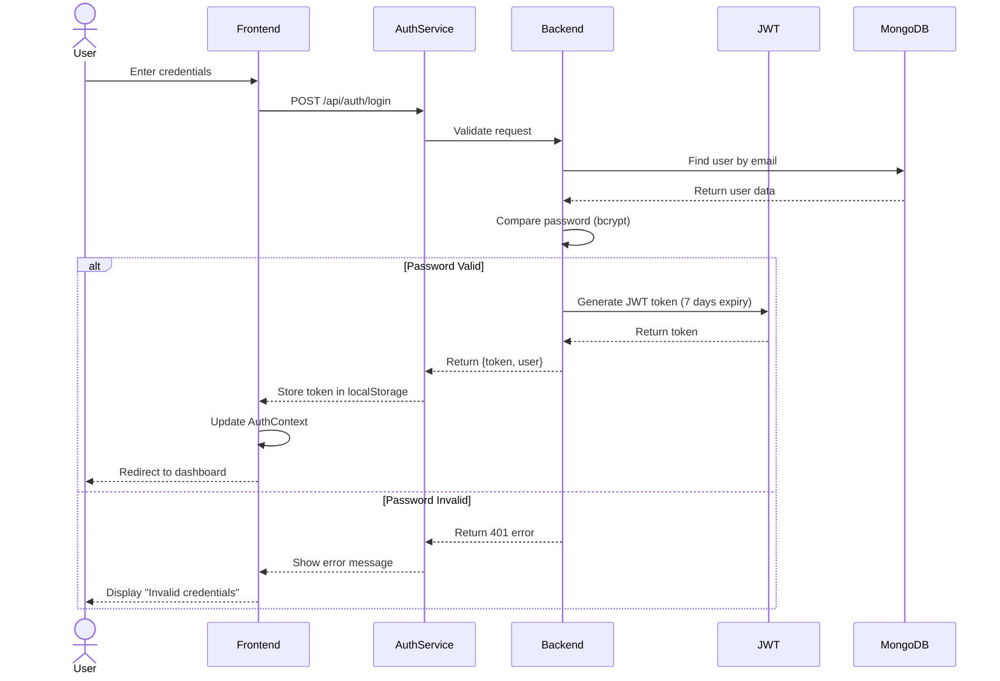
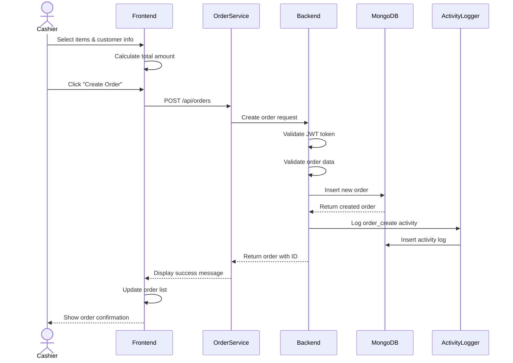
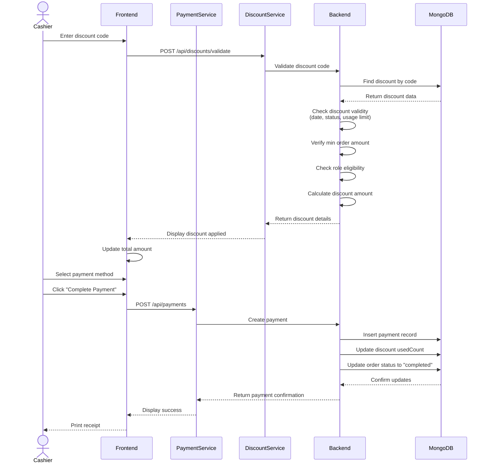
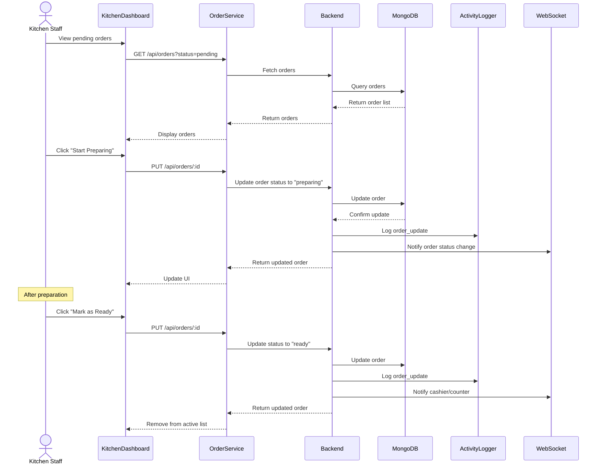
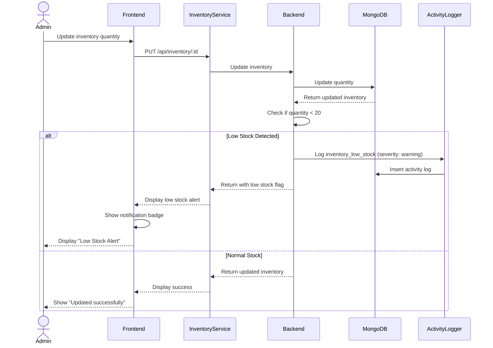
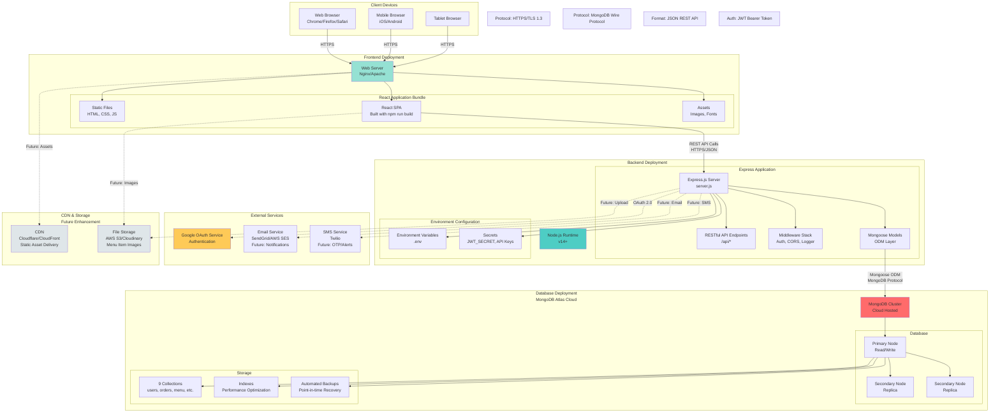
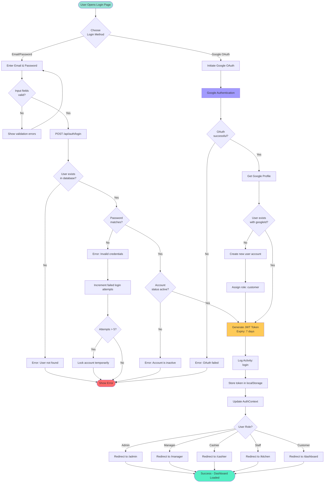
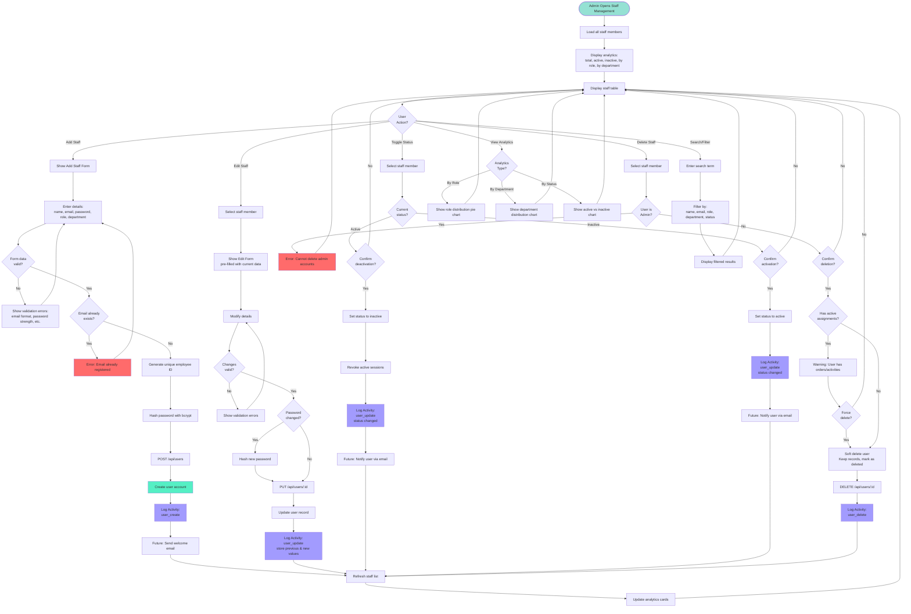

# UML Diagrams - Smart Canteen Management System

This document contains all UML diagrams for the Canteen Management System project.

**Table of Contents:**
1. [Use Case Diagram](#1-use-case-diagram)
2. [Class Diagram](#2-class-diagram)
3. [Sequence Diagrams](#3-sequence-diagrams)
4. [Component Diagram](#4-component-diagram)
5. [Deployment Diagram](#5-deployment-diagram)
6. [Activity Diagrams](#6-activity-diagrams)

---

## 1. Use Case Diagram

Shows all actors and their interactions with the system.

```mermaid
graph TB
    subgraph "Canteen Management System"
        UC1[Login/Logout]
        UC2[View Dashboard]
        UC3[Manage Orders]
        UC4[Create Order]
        UC5[Update Order Status]
        UC6[Cancel Order]
        UC7[Manage Menu Items]
        UC8[Add Menu Item]
        UC9[Update Menu Item]
        UC10[Delete Menu Item]
        UC11[Manage Inventory]
        UC12[Add Inventory Item]
        UC13[Update Stock]
        UC14[View Low Stock Alerts]
        UC15[Manage Staff]
        UC16[Create Staff Account]
        UC17[Update Staff Details]
        UC18[Manage Suppliers]
        UC19[Add Supplier]
        UC20[Rate Supplier]
        UC21[Process Payment]
        UC22[Apply Discount]
        UC23[View Activity Logs]
        UC24[Manage Discounts]
        UC25[Create Discount Code]
        UC26[View Analytics]
        UC27[Submit Feedback]
        UC28[Respond to Feedback]
        UC29[View Reports]
        UC30[Kitchen Order Display]
    end

    Admin((Admin))
    Manager((Manager))
    Cashier((Cashier))
    Staff((Staff/Kitchen))
    Customer((Customer))

    %% Admin Access
    Admin --> UC1
    Admin --> UC2
    Admin --> UC3
    Admin --> UC7
    Admin --> UC11
    Admin --> UC15
    Admin --> UC18
    Admin --> UC21
    Admin --> UC23
    Admin --> UC24
    Admin --> UC26
    Admin --> UC28
    Admin --> UC29

    %% Manager Access
    Manager --> UC1
    Manager --> UC2
    Manager --> UC3
    Manager --> UC7
    Manager --> UC11
    Manager --> UC18
    Manager --> UC21
    Manager --> UC24
    Manager --> UC26
    Manager --> UC28
    Manager --> UC29

    %% Cashier Access
    Cashier --> UC1
    Cashier --> UC2
    Cashier --> UC3
    Cashier --> UC4
    Cashier --> UC21
    Cashier --> UC22

    %% Staff/Kitchen Access
    Staff --> UC1
    Staff --> UC2
    Staff --> UC5
    Staff --> UC30
    Staff --> UC11
    Staff --> UC7

    %% Customer Access
    Customer --> UC1
    Customer --> UC2
    Customer --> UC4
    Customer --> UC27

    %% Use Case Relationships
    UC3 -.->|includes| UC4
    UC3 -.->|includes| UC5
    UC3 -.->|includes| UC6
    UC7 -.->|includes| UC8
    UC7 -.->|includes| UC9
    UC7 -.->|includes| UC10
    UC11 -.->|includes| UC12
    UC11 -.->|includes| UC13
    UC11 -.->|includes| UC14
    UC15 -.->|includes| UC16
    UC15 -.->|includes| UC17
    UC18 -.->|includes| UC19
    UC18 -.->|includes| UC20
    UC21 -.->|extends| UC22
    UC24 -.->|includes| UC25

    style Admin fill:#ff6b6b
    style Manager fill:#4ecdc4
    style Cashier fill:#45b7d1
    style Staff fill:#96ceb4
    style Customer fill:#feca57
```



---

## 2. Class Diagram

Shows all database models and their relationships.

```mermaid
classDiagram
    class User {
        +String _id
        +String name
        +String email
        +String password
        +String phone
        +String googleId
        +String role [admin|manager|cashier|staff|customer]
        +String status [active|inactive]
        +String employeeId
        +String address
        +Date dateOfJoining
        +String department [kitchen|counter|management|inventory|none]
        +Date createdAt
        +Date updatedAt
        +comparePassword(candidatePassword) Boolean
    }

    class Menu {
        +String _id
        +String itemName
        +String category [snacks|beverages|meals|desserts|breakfast]
        +String itemType [homemade|packaged]
        +Number price
        +String description
        +String allergens
        +Boolean available
        +Number stockQuantity
        +Number lowStockThreshold
        +Date expiryDate
        +Date preparedDate
        +String image
        +Object discount
        +ObjectId createdBy
        +ObjectId updatedBy
        +Date createdAt
        +Date updatedAt
    }

    class Order {
        +String _id
        +String customerName
        +String customerEmail
        +String customerPhone
        +Array items [{itemName, quantity, price}]
        +String orderType [online|counter|dine-in]
        +String status [pending|preparing|ready|completed|cancelled]
        +Number totalAmount
        +ObjectId createdBy
        +ObjectId updatedBy
        +Date createdAt
        +Date updatedAt
    }

    class Payment {
        +String _id
        +ObjectId orderId
        +String paymentMethod [cash|card|upi|wallet|payroll-deduction]
        +Number amount
        +Number discountApplied
        +String discountCode
        +Number tax
        +Number finalAmount
        +String paymentStatus [pending|completed|failed|refunded]
        +String transactionId
        +String customerName
        +String customerEmail
        +ObjectId processedBy
        +Number refundAmount
        +String refundReason
        +Date refundedAt
        +String notes
        +Date createdAt
        +Date updatedAt
    }

    class Inventory {
        +String _id
        +String itemName
        +Number quantity
        +String unit [kg|g|l|ml|pcs|packets|boxes]
        +String supplier
        +Date expiryDate
        +String batchNumber
        +ObjectId createdBy
        +ObjectId updatedBy
        +Date createdAt
        +Date updatedAt
    }

    class Supplier {
        +String _id
        +String supplierName
        +String contactPerson
        +String email
        +String phone
        +String address
        +String supplierType [food|beverages|raw-materials|packaging|equipment|other]
        +String status [active|inactive]
        +String gstNumber
        +String paymentTerms [immediate|net-7|net-15|net-30|net-60]
        +Number rating
        +String notes
        +Date createdAt
        +Date updatedAt
    }

    class Discount {
        +String _id
        +String discountName
        +String discountCode
        +String discountType [percentage|fixed]
        +Number discountValue
        +Number minOrderAmount
        +Number maxDiscountAmount
        +Array applicableCategories
        +Date validFrom
        +Date validUntil
        +String status [active|inactive|expired]
        +Number usageLimit
        +Number usedCount
        +Array applicableRoles
        +String description
        +Date createdAt
        +Date updatedAt
    }

    class Feedback {
        +String _id
        +ObjectId orderId
        +String customerName
        +String customerEmail
        +Number rating
        +Number foodQuality
        +Number serviceQuality
        +Number cleanliness
        +Number valueForMoney
        +String comments
        +String sentiment [positive|neutral|negative]
        +String status [pending|reviewed|resolved]
        +String response
        +ObjectId respondedBy
        +Date respondedAt
        +Date createdAt
        +Date updatedAt
    }

    class ActivityLog {
        +String _id
        +String activityType
        +ObjectId performedBy
        +String resourceType
        +ObjectId resourceId
        +String description
        +Object details
        +String severity [info|warning|critical]
        +Array tags
        +Date timestamp
        +Date createdAt
        +Date updatedAt
    }

    %% Relationships
    User "1" --> "0..*" Order : creates
    User "1" --> "0..*" Menu : manages
    User "1" --> "0..*" Inventory : manages
    User "1" --> "0..*" ActivityLog : performs
    User "1" --> "0..*" Payment : processes
    User "1" --> "0..*" Feedback : responds

    Order "1" --> "1" Payment : has
    Order "1" --> "0..1" Feedback : receives
    Order "0..*" --> "0..1" Discount : uses

    Inventory "0..*" --> "1" Supplier : supplied_by

    Menu "0..*" --> "0..1" Discount : has_discount

    ActivityLog "0..*" --> "1" User : performed_by
```

---

## 3. Sequence Diagrams

### 3.1 User Login Sequence



### 3.2 Create Order Sequence



### 3.3 Payment Processing with Discount Sequence



### 3.4 Kitchen Order Update Sequence



### 3.5 Inventory Low Stock Alert Sequence



---

## 4. Component Diagram

Shows the system architecture with all major components.

```mermaid
graph TB
    subgraph "Client Layer - Port 3000"
        subgraph "React Frontend Application"
            App[App.js<br/>Router Configuration]

            subgraph "Context Layer"
                AuthContext[AuthContext<br/>Global State]
            end

            subgraph "Components"
                Public[Public Components<br/>HomePage, Login, Signup]

                subgraph "Admin Components"
                    AdminDash[AdminDashboard]
                    AdminRoutes[Admin Routes<br/>/admin/orders, /admin/menu, etc.]
                end

                subgraph "Feature Modules"
                    Dashboard[Dashboard Module<br/>11 components]
                    Orders[Orders Module<br/>3 components]
                    Menu[Menu Module<br/>3 components]
                    Inventory[Inventory Module<br/>3 components]
                    Staff[Staff Module<br/>5 components]
                    Supplier[Supplier Module<br/>4 components]
                    Discount[Discount Module<br/>13 components]
                    Activity[Activity Log Module<br/>5 components]
                end

                subgraph "Role-Specific Components"
                    Cashier[Cashier Dashboard<br/>5 components]
                    Kitchen[Kitchen Dashboard<br/>2 components]
                    Manager[Manager Dashboard<br/>2 components]
                end

                subgraph "Shared Components"
                    Shared[Reusable Components<br/>ConfirmationModal, SearchBar, Filters]
                end
            end

            subgraph "Services Layer"
                APIService[API Services<br/>discountService.js, etc.]
                Helpers[Helper Functions<br/>dashboardHelpers.js, staffHelpers.js, etc.]
                Hooks[Custom Hooks<br/>useDashboardAnalytics, useDiscountFilters]
            end

            Config[Config<br/>api.js - API Base URL]
        end
    end

    subgraph "Server Layer - Port 5001"
        subgraph "Express.js Backend"
            Server[server.js<br/>Express Server]

            subgraph "Middleware"
                CORS[CORS Middleware]
                Auth[Auth Middleware<br/>JWT Verification]
                AuthZ[Authorization Middleware<br/>Role Checking]
                ActivityLog[Activity Logger Middleware]
            end

            subgraph "Routes"
                AuthRoutes[/api/auth<br/>login, signup, verify]
                OrderRoutes[/api/orders<br/>CRUD Operations]
                MenuRoutes[/api/menu<br/>CRUD Operations]
                InventoryRoutes[/api/inventory<br/>CRUD Operations]
                UserRoutes[/api/users<br/>Staff Management]
                SupplierRoutes[/api/suppliers<br/>CRUD Operations]
                PaymentRoutes[/api/payments<br/>Payment Processing]
                DiscountRoutes[/api/discounts<br/>Discount Management]
                ActivityRoutes[/api/activities<br/>Activity Logs]
                FeedbackRoutes[/api/feedback<br/>Feedback Management]
            end

            subgraph "Models (Mongoose Schemas)"
                UserModel[(User Model)]
                OrderModel[(Order Model)]
                MenuModel[(Menu Model)]
                InventoryModel[(Inventory Model)]
                SupplierModel[(Supplier Model)]
                PaymentModel[(Payment Model)]
                DiscountModel[(Discount Model)]
                ActivityModel[(ActivityLog Model)]
                FeedbackModel[(Feedback Model)]
            end
        end
    end

    subgraph "Database Layer"
        MongoDB[(MongoDB Atlas<br/>Cloud Database)]

        subgraph "Collections"
            UsersCol[(users)]
            OrdersCol[(orders)]
            MenuCol[(menus)]
            InventoryCol[(inventories)]
            SuppliersCol[(suppliers)]
            PaymentsCol[(payments)]
            DiscountsCol[(discounts)]
            ActivityCol[(activitylogs)]
            FeedbackCol[(feedbacks)]
        end
    end

    subgraph "External Services"
        GoogleOAuth[Google OAuth<br/>Authentication]
        JWT[JWT Service<br/>Token Generation]
    end

    %% Connections
    App --> AuthContext
    App --> Public
    App --> AdminDash
    App --> Dashboard
    App --> Orders
    App --> Menu
    App --> Inventory
    App --> Staff
    App --> Supplier
    App --> Discount
    App --> Activity
    App --> Cashier
    App --> Kitchen
    App --> Manager

    Dashboard --> Shared
    Orders --> Shared
    Menu --> Shared
    Inventory --> Shared
    Staff --> Shared
    Supplier --> Shared
    Discount --> Shared
    Activity --> Shared

    Orders --> APIService
    Menu --> APIService
    Inventory --> APIService
    Staff --> APIService
    Supplier --> APIService
    Discount --> APIService

    APIService --> Config
    Dashboard --> Hooks
    Discount --> Hooks
    Hooks --> Helpers

    APIService -->|HTTP Requests| Server
    Public -->|Login/Signup| Server

    Server --> CORS
    Server --> Auth
    Server --> AuthZ
    Server --> ActivityLog

    Server --> AuthRoutes
    Server --> OrderRoutes
    Server --> MenuRoutes
    Server --> InventoryRoutes
    Server --> UserRoutes
    Server --> SupplierRoutes
    Server --> PaymentRoutes
    Server --> DiscountRoutes
    Server --> ActivityRoutes
    Server --> FeedbackRoutes

    AuthRoutes --> UserModel
    OrderRoutes --> OrderModel
    MenuRoutes --> MenuModel
    InventoryRoutes --> InventoryModel
    UserRoutes --> UserModel
    SupplierRoutes --> SupplierModel
    PaymentRoutes --> PaymentModel
    DiscountRoutes --> DiscountModel
    ActivityRoutes --> ActivityModel
    FeedbackRoutes --> FeedbackModel

    UserModel --> MongoDB
    OrderModel --> MongoDB
    MenuModel --> MongoDB
    InventoryModel --> MongoDB
    SupplierModel --> MongoDB
    PaymentModel --> MongoDB
    DiscountModel --> MongoDB
    ActivityModel --> MongoDB
    FeedbackModel --> MongoDB

    MongoDB --> UsersCol
    MongoDB --> OrdersCol
    MongoDB --> MenuCol
    MongoDB --> InventoryCol
    MongoDB --> SuppliersCol
    MongoDB --> PaymentsCol
    MongoDB --> DiscountsCol
    MongoDB --> ActivityCol
    MongoDB --> FeedbackCol

    AuthRoutes -.->|OAuth| GoogleOAuth
    AuthRoutes -.->|Generate Token| JWT
    Auth -.->|Verify Token| JWT

    style Server fill:#4ecdc4
    style MongoDB fill:#ff6b6b
    style App fill:#95e1d3
    style GoogleOAuth fill:#feca57
    style JWT fill:#feca57
```

---

## 5. Deployment Diagram

Shows how the system is deployed across different servers and environments.



### Deployment Specifications

**Frontend (Vercel/Netlify):**
- Build Command: `npm run build`
- Output Directory: `build/`
- Environment Variables: `REACT_APP_GOOGLE_CLIENT_ID`, `REACT_APP_API_URL`
- Auto-deploy on: `main` branch push

**Backend (Heroku/Railway/Render):**
- Start Command: `npm start` or `node server.js`
- Node Version: `14.x` or higher
- Environment Variables: `MONGODB_URI`, `PORT`, `JWT_SECRET`, `GOOGLE_CLIENT_ID`
- Auto-deploy on: `main` branch push

**Database (MongoDB Atlas):**
- Tier: M0 (Free) or M10 (Production)
- Region: Closest to backend server
- Backup: Automated daily snapshots
- Network Access: Whitelist backend server IPs

---

## 6. Activity Diagrams

### 6.1 Order Processing Workflow

```mermaid
flowchart TD
    Start([Customer/Cashier Places Order]) --> ValidateItems{Are all items<br/>available?}

    ValidateItems -->|No| NotifyUnavailable[Notify unavailable items]
    NotifyUnavailable --> RemoveItems[Remove/Replace items]
    RemoveItems --> ValidateItems

    ValidateItems -->|Yes| CalculateTotal[Calculate Total Amount]
    CalculateTotal --> CheckDiscount{Has discount<br/>code?}

    CheckDiscount -->|Yes| ValidateDiscount[Validate Discount Code]
    ValidateDiscount --> DiscountValid{Is discount<br/>valid?}

    DiscountValid -->|No| ShowDiscountError[Show error message]
    ShowDiscountError --> CheckDiscount

    DiscountValid -->|Yes| ApplyDiscount[Apply Discount]
    ApplyDiscount --> CalculateFinal[Calculate Final Amount]

    CheckDiscount -->|No| CalculateFinal

    CalculateFinal --> CreateOrder[Create Order<br/>Status: Pending]
    CreateOrder --> LogActivity1[Log Activity:<br/>order_create]
    LogActivity1 --> SelectPayment{Payment<br/>immediate?}

    SelectPayment -->|Yes| ProcessPayment[Process Payment]
    ProcessPayment --> PaymentSuccess{Payment<br/>successful?}

    PaymentSuccess -->|No| PaymentFailed[Mark Payment Failed]
    PaymentFailed --> RetryPayment{Retry?}
    RetryPayment -->|Yes| ProcessPayment
    RetryPayment -->|No| CancelOrder[Cancel Order]
    CancelOrder --> LogActivity2[Log Activity:<br/>order_cancel]
    LogActivity2 --> End1([End])

    PaymentSuccess -->|Yes| UpdatePayment[Update Payment Status]
    UpdatePayment --> NotifyKitchen[Notify Kitchen Staff]

    SelectPayment -->|No| NotifyKitchen

    NotifyKitchen --> KitchenReceives[Kitchen Receives Order]
    KitchenReceives --> UpdateToPreparing[Update Status:<br/>Preparing]
    UpdateToPreparing --> LogActivity3[Log Activity:<br/>order_update]
    LogActivity3 --> PrepareOrder[Prepare Order]
    PrepareOrder --> UpdateToReady[Update Status:<br/>Ready]
    UpdateToReady --> LogActivity4[Log Activity:<br/>order_update]
    LogActivity4 --> NotifyCounter[Notify Counter/Cashier]
    NotifyCounter --> DeliverOrder[Deliver Order to Customer]
    DeliverOrder --> UpdateToCompleted[Update Status:<br/>Completed]
    UpdateToCompleted --> LogActivity5[Log Activity:<br/>order_complete]
    LogActivity5 --> UpdateInventory[Update Inventory Stock]
    UpdateInventory --> CheckLowStock{Stock below<br/>threshold?}

    CheckLowStock -->|Yes| GenerateLowStockAlert[Generate Low Stock Alert]
    GenerateLowStockAlert --> LogActivity6[Log Activity:<br/>inventory_low_stock]
    LogActivity6 --> End2([End])

    CheckLowStock -->|No| End2

    style Start fill:#95e1d3
    style End1 fill:#ff6b6b
    style End2 fill:#95e1d3
    style CreateOrder fill:#4ecdc4
    style ProcessPayment fill:#feca57
    style NotifyKitchen fill:#a29bfe
```



### 6.2 Discount Validation Workflow

```mermaid
flowchart TD
    Start([User Enters Discount Code]) --> NormalizeCode[Convert to Uppercase]
    NormalizeCode --> FetchDiscount[Fetch Discount from Database]
    FetchDiscount --> DiscountExists{Discount<br/>exists?}

    DiscountExists -->|No| Error1[Error: Invalid discount code]
    Error1 --> End1([Return Error])

    DiscountExists -->|Yes| CheckStatus{Status is<br/>active?}

    CheckStatus -->|No| Error2[Error: Discount is inactive/expired]
    Error2 --> End1

    CheckStatus -->|Yes| CheckDate{Current date<br/>within validity?}

    CheckDate -->|No| Error3[Error: Discount expired or not yet valid]
    Error3 --> End1

    CheckDate -->|Yes| CheckUsageLimit{Has usage<br/>limit?}

    CheckUsageLimit -->|Yes| CheckUsageCount{Used count <<br/>usage limit?}
    CheckUsageCount -->|No| Error4[Error: Usage limit reached]
    Error4 --> End1

    CheckUsageLimit -->|No| CheckMinAmount
    CheckUsageCount -->|Yes| CheckMinAmount

    CheckMinAmount{Order amount >=<br/>min amount?}

    CheckMinAmount -->|No| Error5[Error: Minimum order amount not met]
    Error5 --> End1

    CheckMinAmount -->|Yes| CheckRole{User role<br/>eligible?}

    CheckRole -->|No| Error6[Error: Discount not applicable for your role]
    Error6 --> End1

    CheckRole -->|Yes| CheckCategory{Order categories<br/>match?}

    CheckCategory -->|No| Error7[Error: Discount not applicable for selected items]
    Error7 --> End1

    CheckCategory -->|Yes| CalculateDiscount[Calculate Discount Amount]
    CalculateDiscount --> CheckType{Discount<br/>type?}

    CheckType -->|Percentage| CalculatePercentage[Calculate: amount * (value/100)]
    CalculatePercentage --> CheckMaxCap{Has max<br/>discount cap?}

    CheckMaxCap -->|Yes| ApplyCap[Apply max discount cap if exceeded]
    CheckMaxCap -->|No| CalculateFinal
    ApplyCap --> CalculateFinal

    CheckType -->|Fixed| UseFixedValue[Use fixed discount value]
    UseFixedValue --> CalculateFinal[Calculate Final Amount]

    CalculateFinal --> ValidatePositive{Final amount<br/>> 0?}

    ValidatePositive -->|No| Error8[Error: Discount exceeds order amount]
    Error8 --> End1

    ValidatePositive -->|Yes| PrepareResponse[Prepare Discount Details]
    PrepareResponse --> IncrementUsage[Increment usedCount]
    IncrementUsage --> LogActivity[Log Activity:<br/>discount_applied]
    LogActivity --> Success([Return Success<br/>with discount details])

    style Start fill:#95e1d3
    style End1 fill:#ff6b6b
    style Success fill:#55efc4
    style CalculateDiscount fill:#feca57
    style LogActivity fill:#a29bfe
```

### 6.3 User Authentication Workflow



### 6.4 Inventory Management Workflow

```mermaid
flowchart TD
    Start([Staff/Admin Opens Inventory]) --> LoadInventory[Load all inventory items]
    LoadInventory --> DisplayInventory[Display inventory table]
    DisplayInventory --> UserAction{User<br/>Action?}

    UserAction -->|Add Item| ShowAddForm[Show Add Inventory Form]
    ShowAddForm --> EnterDetails[Enter item details<br/>name, quantity, unit, supplier, expiry]
    EnterDetails --> ValidateForm{Form data<br/>valid?}

    ValidateForm -->|No| ShowFormErrors[Show validation errors]
    ShowFormErrors --> EnterDetails

    ValidateForm -->|Yes| LoadSuppliers[Load supplier list]
    LoadSuppliers --> CheckSupplier{Supplier<br/>exists?}

    CheckSupplier -->|No| AddSupplierOption[Show "Add New Supplier" option]
    AddSupplierOption --> EnterDetails

    CheckSupplier -->|Yes| SubmitAdd[POST /api/inventory]
    SubmitAdd --> CreateInventory[Create inventory record]
    CreateInventory --> LogActivity1[Log Activity:<br/>inventory_create]
    LogActivity1 --> RefreshList[Refresh inventory list]
    RefreshList --> DisplayInventory

    UserAction -->|Update Item| SelectItem[Select inventory item]
    SelectItem --> ShowEditForm[Show Edit Form<br/>pre-filled with current data]
    ShowEditForm --> ModifyDetails[Modify details]
    ModifyDetails --> ValidateUpdate{Changes<br/>valid?}

    ValidateUpdate -->|No| ShowUpdateErrors[Show validation errors]
    ShowUpdateErrors --> ModifyDetails

    ValidateUpdate -->|Yes| SubmitUpdate[PUT /api/inventory/:id]
    SubmitUpdate --> CheckQuantityChange{Quantity<br/>changed?}

    CheckQuantityChange -->|Yes| LogPreviousValue[Store previous quantity]
    LogPreviousValue --> UpdateInventory[Update inventory record]
    UpdateInventory --> CheckNewQuantity{New quantity<br/>< 20?}

    CheckNewQuantity -->|Yes| GenerateAlert[Generate Low Stock Alert]
    GenerateAlert --> LogActivity2[Log Activity:<br/>inventory_low_stock<br/>severity: warning]
    LogActivity2 --> NotifyAdmin[Notify Admin/Manager]
    NotifyAdmin --> LogActivity3[Log Activity:<br/>inventory_update]

    CheckNewQuantity -->|No| LogActivity3
    CheckQuantityChange -->|No| UpdateInventory

    LogActivity3 --> RefreshList

    UserAction -->|Delete Item| SelectDelete[Select item to delete]
    SelectDelete --> ShowConfirmation{Confirm<br/>deletion?}

    ShowConfirmation -->|No| DisplayInventory
    ShowConfirmation -->|Yes| SubmitDelete[DELETE /api/inventory/:id]
    SubmitDelete --> CheckDependencies{Item used in<br/>menu/orders?}

    CheckDependencies -->|Yes| WarningMessage[Show warning:<br/>Item is in use]
    WarningMessage --> ForceDelete{Force<br/>delete?}
    ForceDelete -->|No| DisplayInventory
    ForceDelete -->|Yes| DeleteInventory

    CheckDependencies -->|No| DeleteInventory[Delete inventory record]
    DeleteInventory --> LogActivity4[Log Activity:<br/>inventory_delete]
    LogActivity4 --> RefreshList

    UserAction -->|Check Expiry| FilterExpiring[Filter items expiring soon<br/>within 7 days]
    FilterExpiring --> DisplayExpiring[Display expiring items modal]
    DisplayExpiring --> CheckExpired{Items<br/>expired?}

    CheckExpired -->|Yes| HighlightExpired[Highlight expired items in red]
    HighlightExpired --> SuggestDiscount[Suggest applying discount]
    SuggestDiscount --> ApplyDiscount{Apply<br/>discount?}

    ApplyDiscount -->|Yes| CreateMenuDiscount[Apply discount to menu items]
    CreateMenuDiscount --> LogActivity5[Log Activity:<br/>discount_create<br/>reason: expiry]
    LogActivity5 --> DisplayInventory

    ApplyDiscount -->|No| DisplayInventory
    CheckExpired -->|No| DisplayInventory

    UserAction -->|View Low Stock| FilterLowStock[Filter items with quantity < 20]
    FilterLowStock --> DisplayLowStock[Display low stock items modal]
    DisplayLowStock --> SuggestReorder[Suggest reordering]
    SuggestReorder --> ContactSupplier{Contact<br/>supplier?}

    ContactSupplier -->|Yes| OpenSupplierPage[Open supplier management]
    ContactSupplier -->|No| DisplayInventory
    OpenSupplierPage --> End1([Navigate to Suppliers])

    style Start fill:#95e1d3
    style End1 fill:#4ecdc4
    style GenerateAlert fill:#ff6b6b
    style LogActivity1 fill:#a29bfe
    style LogActivity2 fill:#a29bfe
    style LogActivity3 fill:#a29bfe
    style LogActivity4 fill:#a29bfe
    style LogActivity5 fill:#a29bfe
```

### 6.5 Staff Management Workflow



---

## Summary

This document provides comprehensive UML diagrams covering:

1. **Use Case Diagram** - All 5 user roles and their 30+ interactions with the system
2. **Class Diagram** - 9 database models with complete attributes and relationships
3. **Sequence Diagrams** - 5 critical workflows including login, orders, payments, kitchen operations, and inventory alerts
4. **Component Diagram** - Complete system architecture showing React frontend (50+ components), Express backend (10+ routes), and MongoDB database
5. **Deployment Diagram** - Production deployment setup with Vercel/Netlify (frontend), Heroku/Railway (backend), and MongoDB Atlas
6. **Activity Diagrams** - 5 detailed workflows for order processing, discount validation, authentication, inventory management, and staff management

### Key Statistics:
- **Actors:** 5 (Admin, Manager, Cashier, Staff, Customer)
- **Use Cases:** 30+
- **Database Models:** 9
- **API Routes:** 10
- **Frontend Components:** 60+
- **Deployment Layers:** 3 (Client, Server, Database)
- **External Services:** 3 (Google OAuth, Email, SMS - future)

These diagrams accurately represent the current implementation of the Smart Canteen Management System and can be used for documentation, presentations, or onboarding new developers.
